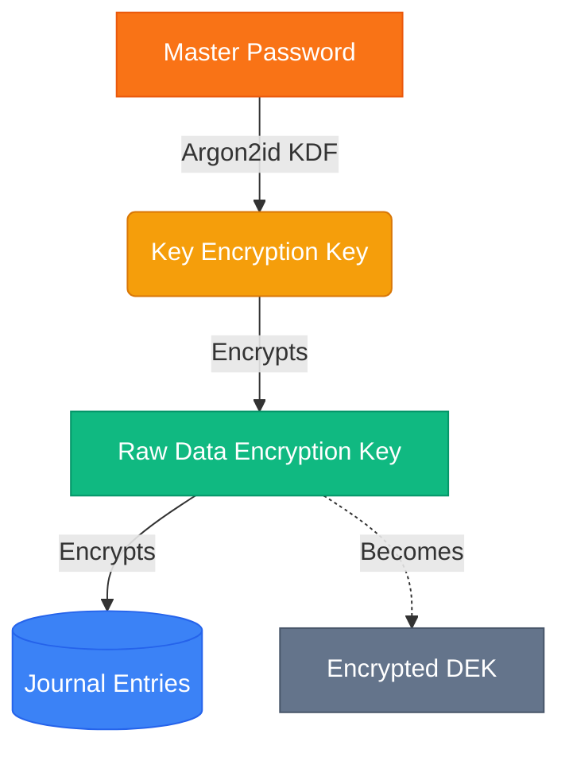
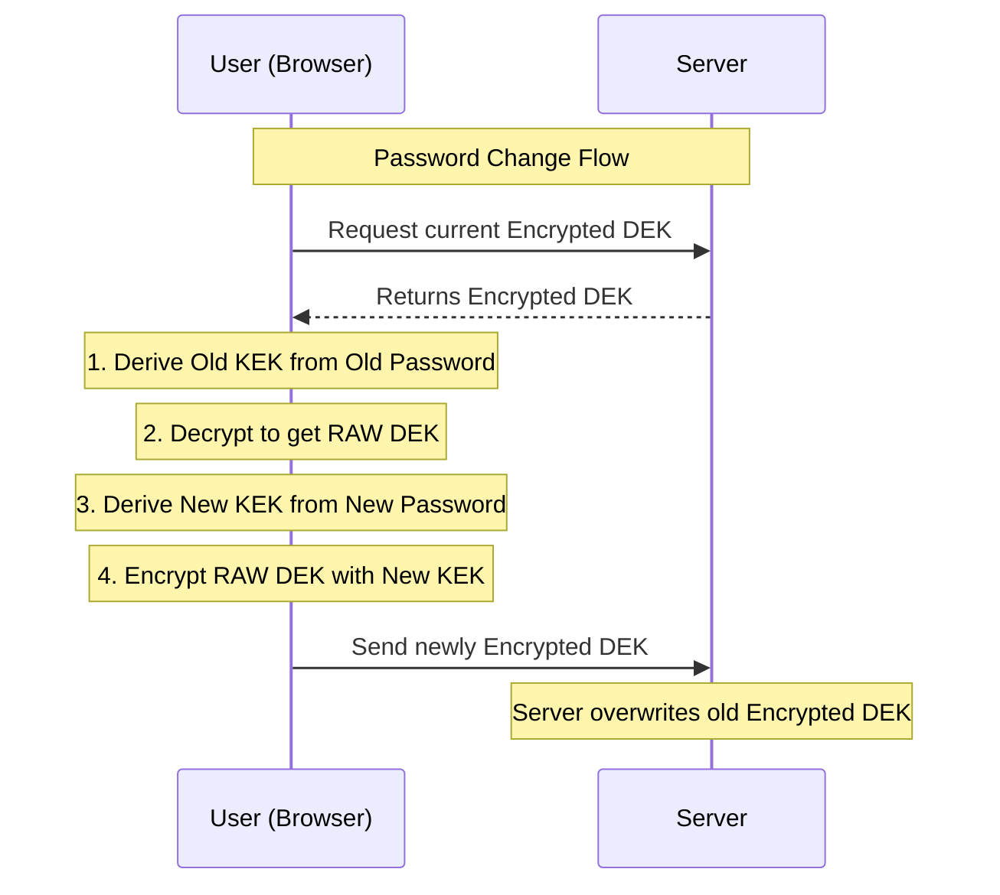

# End-to-End Encryption (E2EE) Architecture

Building a true "Zero-Knowledge" End-to-End Encrypted architecture means that **the server must never be able to read your data**, even if the database is fully compromised by an attacker (or rogue admin).

To accomplish this while allowing users to change their passwords instantly, we use a **Two-Tier Key Architecture**.

## The Two-Tier Key System

Instead of using your password directly to lock your journal entries, we use a two-step "lockbox" approach:

1. **The Data Encryption Key (DEK):** A randomly generated, highly secure cryptographic key. This key's *only* job is to encrypt and decrypt your journal entries.
2. **The Key Encryption Key (KEK):** A key derived mathematically from your Master Password. This key's *only* job is to encrypt the DEK.

Think of it like this: You put all your journals in a massive Vault, and lock it with a physical key (the DEK). Then, you put that physical key inside a small Lockbox, and lock the Lockbox with a combination code (your Password).

## The Flows in Action

### 1. Signup Flow (Creating the Lockbox)
When a user signs up:
1. Your browser randomly generates the **DEK**.
2. Your browser asks for your **Password** and derives your **KEK**.
3. Your browser encrypts the DEK using your KEK.
4. The browser sends the **Encrypted DEK** to the server.
*Crucially: The server never sees your Password, and never sees the raw DEK.*

### 2. Login Flow (Opening the Lockbox)
When you log in:
1. The server hands your browser the **Encrypted DEK**.
2. You type your **Password**.
3. Your browser derives your **KEK** and uses it to unlock the **Encrypted DEK**.
4. The raw **DEK** is temporarily held in your browser's RAM, where it is used to instantly decrypt journal entries as you scroll.
*Crucially: When you close the tab, the RAM is cleared, and the DEK is gone.*

### 3. Password Change Flow (Changing the Lockbox Code)
If we didn't have a DEK, changing your password would mean downloading all 5,000 of your journal entries, decrypting them all with your old password, re-encrypting them all with your new password, and uploading them back to the server. This would take minutes and kill mobile batteries.

With the DEK Architecture:
1. You enter your **Old Password** and **New Password**.
2. Your browser uses the Old Password to open the Lockbox and pull out the **raw DEK**.
3. Your browser derives a **New KEK** from your New Password.
4. Your browser puts the DEK into a *new* Lockbox (encrypts it with the New KEK).
5. The browser sends the new **Encrypted DEK** to the server.

## Why this is the Industry Standard
This exact architecture (DEK + KEK) is what powers massive End-to-End Encrypted systems like **1Password, Bitwarden, Signal, and WhatsApp**. It guarantees absolute zero-knowledge privacy for the user while remaining incredibly fast and scalable!
